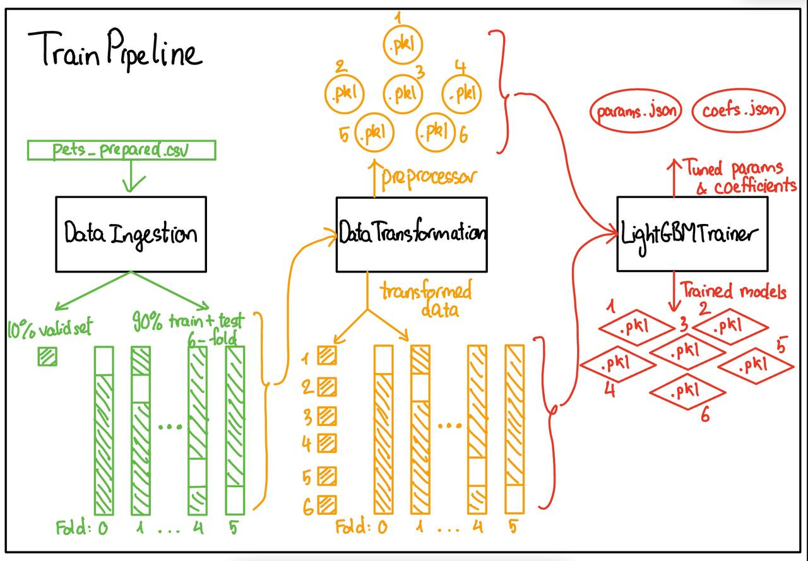
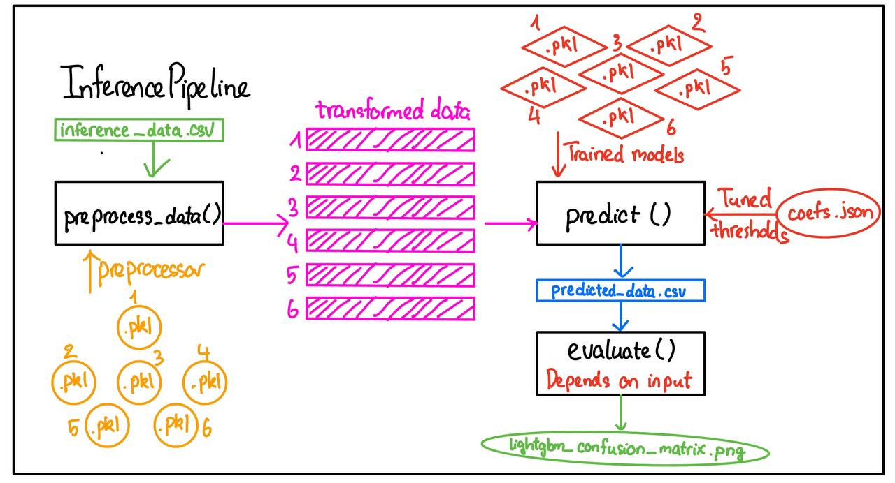
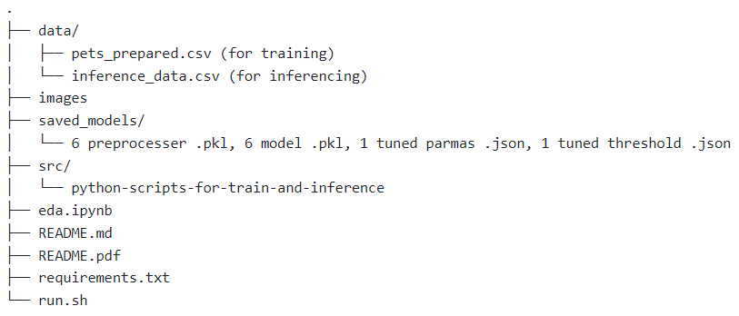
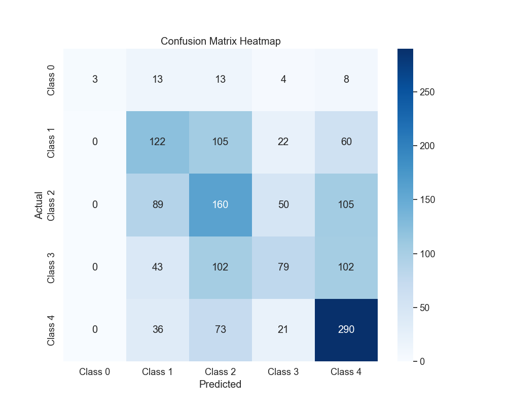
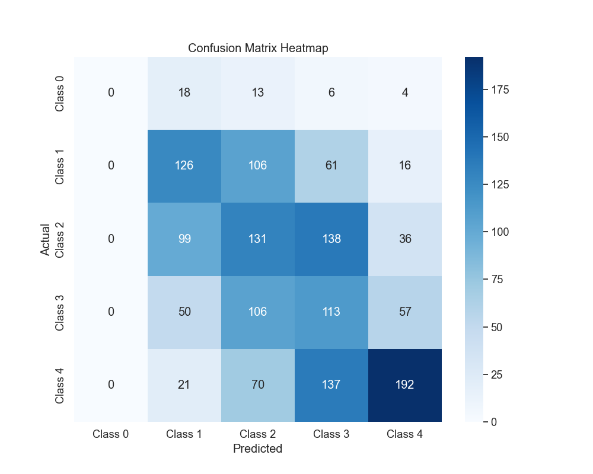

# **National AI Student Challenge 2024**
# Technical Assessment

### **General information**

**Full name (as in NRIC)**: Bui Duc Thanh 

**Email address**: bdthanh@u.nus.edu

**Python version**: 3.11.4

**OS platform**: Windows 11 

**Libraries/Packages**: scikit-learn, pandas, numpy, ipykernel, matplotlib, seaborn, imbalanced-learn, optuna, xgboost, catboost, lightgbm, scipy, nltk, spaCy, dill, langdetect 
 
## Table of contents 
[A. Abstract](#a-abstract)

[B. Overview of submitted folder and its structure](#b-overview-of-submitted-folder-and-its-structure)

[C. Exploratory data analysis](#c-exploratory-data-analysis)

[D. Logical steps/flow of the pipeline](#d-logical-steps--flow-of-the-pipeline)

[E. Instruction to execute the pipeline](#e-instruction-to-execute-the-pipeline)

[F. Explanation of my choice of models](#f-explanation-of-my-choice-of-models)

[G. Explanation of my choice of evaluation metrics](#g-explanation-of-my-choice-of-evaluation-metrics)

[H. Evaluation of models developed](#h-evaluation-of-models-developed)

[I. Code/System design](#i-codesystem-design)

[J. Ethics consideration](#j-ethics-consideration)

[K. Experiments conducted](#k-experiments-conducted)

[L. Future works/experiments](#l-future-worksexperiments)

[M. Deployment considerations](#m-deployment-considerations)

### **A. Abstract**

PetFinder.my is one of the leading pet adoption portals in Malaysia and a non-profit organisation for animal welfare. In recent years, it has faced falling donations and slower adoption rates. The organisation is working on a new business model that will allow it to be more self-sustainable and is looking at ways to increase revenue through advertising and sponsorships.

The adoption rate is one of the key metrics for the organisation. With better adoption rate, the organization can have continuous fresh new contents for the portal, which in turn help to boost revenue from sponsorship and partnership. More importantly, better adoption rate means more animals can find new home sooner.

For this project, Petfinders will want predict adoption for the pet listing and to understand what factors affect the adoption rate. For example, whether more images or videos help to improve adoption chances; how to optimise the hosting and streaming of images/videos, without affecting listings appeal.

### **B. Overview of submitted folder and its structure**
1. `eda.ipynb`: Exploratory Data Analysis notebook. This is to explore the data and use the findings to make decisions about the pipeline. The summerize findings are located at the end of the files, the key findings are in between the code blocks.
2. `src`: This folder stores the main scripts for the pipeline (data ingestion, data transformation, hyperparameter tuning, model training, evaluation, inference pipeline)
- `A_data_ingestion.py`: This file reads the dataset `pet_prepared.csv` and splits it into train, test, valid sets. The valid set is 10% of the dataset and the train, test sets are split using StratifiedKFold with 6 folds. So, the train sets are around 75% of the dataset. The data is then saved into csv files.
- `C_data_transformation.py`: This file is responsible for  doing feature engineer and preprocess data used in train pipeline. It also saves the preprocessor for each fold to pickle files, which are used in inference pipeline.
- `D_training_script_lightgbm.py`: This file is responsible for model training steps, including hyperparameter tuning with Optuna, training with `best_params` and evaluate the models with valid set (with and without ensemble). Refer to [Explanation of my choice of models](#f-explanation-of-my-choice-of-models) for algorithm decisions.
- `E_train_pipeline.py`: This files create a higher class to abstract the first 3 files. It combines the three steps above into train pipeline (to get preprocessor files and model files).
- `F_inference_pipeline.py`: This class is for inference pipeline. It contains methods to do preprocess data, make prediction, ensemble from 6 models to get final prediction. If the data used has target columns, it also automatically evaluate the prediction with Quadratic Weighted Kappa and a detailed classification report.
- `G_train_and_inference_pipeline.py`: This files combines 2 files `E_train_pipeline.py` and `F_inference_pipeline.py` to an end-to-end pipeline from data ingestion to model training to inference. 
- Other files with `U_` prefix are used for utilities. `U_constants.py` stores all the constants used across the code base, `U_utils.py` contains some utils functions, `U_eval_metric.py` contains function to calculate Quadratic Weighted Kappa metric and class `OptimizedRounder` for optimizing decision thresholds, `U_exception.py` and `U_logger.py` are used for setting up custom exception and logging system.
3. `images`: Saves images from `EDA.ipynb`, and some images used in `README.md`, please DO NOT delete any
4. `saved_model`: This folders stores 6 trained models and corresponding 6 data preprocessor objects, the best set of parameters and decision thresholds after tuning, and the confusion matrix image of predicted valid data.
5. `README.md`: Documentation for this project and pipeline.
6. `README.pdf`: Documentation for this project and pipeline under PDF format (converted from README.md).
7. `requirements.txt`: List of used libraries in the pipeline.
8. `run.sh`: Bash script to run the modules/pipeline.

### **C. Exploratory Data Analysis**
1. **Techniques**: 

For EDA, I apply univariate, bivariate and text analysis and use appropriate visualization for each feature
- **Univariate Analysis**: Each feature is inspected individually to understand its distribution and potential outliers. This will provide insights into the characteristics of each variable and help identify any extreme values or anomalies.
- **Bivariate Analysis**: I explored the relationship between each feature and the target (AdoptionSpeed). This allow us to understnad how each variable is associated with the speed of adoption.
- **Text Analysis**: I utilize Term Frequency-Inverse Document Frequency (Tfidf) to list the most used words for each class of the target (AdoptionSpeed). Tfidf analysis is instrumental in distinguishing words that are particularly relevant to each AdoptionSpeed class by weighing the frequency of words against their inverse frequency across all documents, thereby highlighting words that are uniquely significant to certain classes. 

2. **Key Findings**: For visualisation, please refer to `eda.ipynb` or `images` folder
   
**AdoptionSpeed**: The number of entries in class 4 (Adopted on the same day as it was listed) is significanly lower than other 4 classes with only 2.7%. 97.3% of other animals are distributed quite evenly among 4 classes (between 1 and 7 days, between 8 and 30 days, between 31 and 90 days, and after 100 days). We can see that the target are ordinal, meaning that it has natural order.

**Age**: The age distribution follows a normal distribution and quite left skewed. The majority of animal are from 0 to 6 months. From the boxplot, we can see that older animals are likely to be adopted later (distribution of class 4).

**Quantity**: The majority of items have only one animal. The number of items that have more than 6 animals is insignificant. From the boxplot, we can see that higher quantity are likely to be adopted later (distribution of class 4)

**PhotoAmt**: The majority of animals have at lease 1 photo in their post. The number of animals that have more than 10 photos is insignificant. If the post does not have any photo, the adopter/user tends not to adopt that animal (the number in class 4 is high > 50%). And that number improves when the number of images increases  

**VideoAmt**: Most animals do not have any video in their posts. The number of animals that have more than 2 video is insignificant.

**AgeBins**: The majority of animal are from 0 to 6 months. From 6-24 months, the number in each bins is evenly distributed at around 10% and only 3.9% animals are more than 5 years old. The age distribution follows a normal distribution and quite left skewed. The majority of animal are from 0 to 6 months.

**FeeBins**: Most animal are free to adopt with 84.5%. Fewer animals have adoption fee greater than 200, only 8.5% in total. The distribution of classes are not so different across classes no matter how much the fee is. 

**VideoAmtBins**: Left-skewed. Most animals do not have any video in their posts. Only 2.8% animals have one video and other 1% have 2 videos. Looking into the percentage of animals that are adopted after 100 days (class 4), we noticed that when the post has at least one video, that percentage (class 4) drops.

**PhotoAmtBins**: The majority of animals have at lease 1 photo in their post ~ 97.7%. The number of animals seems less when the number of photos increases. The number of photo increases can affect the adoption speed positively. For those with no photos, upto 62.4% are not adopted after 100 days, while in other bins, that numbers are just at about 25% to 32%.

**QuantityBins**: The majority of items have only one animal ~ 77.2%. And the number of items in each bins decreases when the quantity increases. If the quantity of animals is high, the chance of early adoption is lower (the percentage of class 4 increases)

**BreedPure**: The number of breedpure animals are less than the number of not-breed-pure animals. Althought the difference in distribution between different breeds is not significant, from the diagram, we can see that the breedpure animals tend to be adopted earlier.

**NameorNO**: Most animals are named, only 9.1% animals are unnamed. Named animals tend to be adopted earlier.

**TypeName**: The number of dogs and cats in the data are not so different at 54.3 and 45.7%, respectively.

**GenderName**: About half of animal listed are female. Other 36.9% are male and the rest are mixed sex (group of pets). Males are more likely to be adopted sooner than female (see percentages in class 0, 1, 2).

**MaturitySizeName**: About two-thirds of animals are medium in size. The number of XLarge animals is significantly low at 0.2%. Smaller sizes are more preffered compared to others

**FurLengthName**: Most animals have short or medium fur length, the number of long fur animals is quite low compared to other 2 types at 5.5%. Longer fur animals are more preffered compare to shorter fur

**HealthName**: Most animals are healthy, only 3.2% animals have minor injury and 0.2% animal have serious injury. The difference in class distribution can be clearly seen from the diagram. Healthy animal are adopted sooner than injured animals, and serious injured animals has quite high chance to be adopted after 100 days (41.2%)

**VaccinatedName**: Half of the animals are NOT vacinatted, while for other half, 39.3% are vaccinated, and others are not sure. Animals that are not vaccinated are adopted faster

**DewormedName**: More than a half of animals are dewormed and others are not sure or not dewormed yet. Animals that are not dewormed are adopted faster

**SterilizedName**: 67.2% animals are sterilized, and 20.7% animals are not. And the rest are not sure. Animals that are not sterilized are adopted faster

**StateName**: The majority of animals are adopted in 4 big cities: Selangor, Kualar Lumpur, Pulau Pinang, and Johor, with half of the animals are adopted in Selangor. 

**ColorName**: The mojority of animals are either black and brown with total of 74.5%. The rest are evenly distributed among 5 other colors: golden, cream, gray, white and yellow. Animals with colors golden, cream, gray and white are preffered than other with black, brown and yellow fur
  

3. **Decisions / Choices of features, feature engineering and model algorithms**:

**Data preparation and feature engineering**:
For data preprocessing, I decided to limit the number, since the number of entries after that limit are insignificant.
- **Quantity**: Replace all values greater than 6 with 6

- **PhotoAmt**: Replace all values greater than 10 with 10

- **VideoAmt**: Replace all values greater than 2 with 2   

- **BreedName**: I only keep the top 12 most common breed names (6 for dogs and 6 for cats), then combine other classes into 'Other' to reduce the cardinality

- Use OrdinalEncoding for categorical data instead of OneHotEncoding to reduce feature space and training time (see Model Selection)

- Handle text data more carefully by finding out other common words and acronyms, that are not contribute to the context of the problem and removing them.

- Use truncated SVD or other dimensionality reduction methods to reduce the feature space from Tf-idf

**Model/algorithm selection**:

- I treated this problem as a regression problem, instead of a normal classification problem to capture the order of classes. I will do threshold finetune later for better prediction. 

- Since the number of categorical data are quite huge and the number of categories is also big, if I use one hot encoding, the feature space will be enormous and the data is quire spare. Many models will face with the curse of dimensionality, therefore, I decide to go with models that do not require one hot encode and has native support for categorical data. **LightGBM** for example 

**Input selection**

- The original data set have some duplicates columns for example (`Type`, and `TypeName`). For model training, I only use `Type` (with encoded name as number) for easier data preprocess. And for Exploratory Data Analysis, I use `TypeName` for better visualisation.

- I decide to use tree-based algorithms, which can natively help me to find the good feature to split to maximize information gain, so for this project, I do not do any input selection and let the algorithms decide. This method might introduce more noise to the data and might cause overfitting. I will do input selection carefully if I have more time for this project.

### **D. Logical steps / flow of the pipeline**
The end-to-end pipeline contains of 2 main sub-pipelines: train pipeline and inference pipeline

1. **Train pipeline**

The train pipeline includes 3 modules: `DataIngestion`, `DataTransformation`, and `LightGBMTrainer`, and each of them has its own responsibility: 
- `DataIngestion`: It ingests the original dataset given and splits it into train, test, valid sets. The valid set is 10% of the dataset and the train, test sets are split using StratifiedKFold with 6 folds. So, the train sets are around 75% of the dataset. The data is then saved into csv files.
- `DataTransformation`: This module is responsible for doing feature engineer and preprocessing data used in train pipeline. It also saves the preprocessor for each fold to pickle files, which are used in inference pipeline. There are 6 preprocessors corresponding with each fold, this will **prevent data leakage** as the training data are different 
- `LightGBMTrainer`: This module is responsible for model training steps, including hyperparameter tuning, training models with `best_params` and evaluate the models with valid set (with and without ensemble). Refer to [Explanation of my choice of models](#f-explanation-of-my-choice-of-models) for algorithm decisions.
   
2. **Inference pipeline**

The inference pipeline includes 3 main methods as shown on the image: `preprocess_data()`, `predict()` and `evaluate()`
- `preprocess_data()`: This function loads the preprocessors created from the training pipeline and loads the inference data from .csv file. Transformed data is then generated for each fold.
- `predict()`: This function loads the trained models along with the best coefficients (thresholds) created from the training pipeline. Transformed data then passes into the model to make prediction. Finally, predicted target goes through majority voting to get the final ensemble prediction. This column will be concatenated to the `inference_data` and save under `predicted_data.csv`.
- `evaluate()`: This function is only used when the `InferencePipeline` can detect the `AdoptionSpeed` columns in the data from `inference_data.csv`, otherwise, it skips this step. It is evaluated with Quadratic Weighted Kappa score, classification reports and the confusion matrix (image saved in `saved_model`)

### **E. Instruction to execute the pipeline**

1. Download the my project zip file, and unzip it
2. In the same parent folder with `src`, create another folder named `data`, the folder stucture looks like this: 

1. In the data folder, put the original training data `pets_prepared.csv` inside, and any inference data MUST be named as `inference_data.csv` (all columns needed except the target AdoptionSpeed)
2. Activate the environments with all libraries and packages in `requirements.txt`
3. `cd` to src, and run the file `G_train_and_inference_pipeline.py` to run the entire pipeline, including preprocessing, training and inferencing. However, the folder `saved_model` has the file `lightgbm_best_params.json`, so it won't trigger the hyperparamter tuning steps.
4. (OPTIONAL) To do hyperparameter tuning, you can delete that `.json` file and rerun. WARNINGS: it takes quite a long time ~3 hours for 200 trials. To change number of trials, you can go to `U_constants.py` and change `NUM_TRIALS = xx` (NOT RECOMMENDED)

### **F. Explanation of my choice of models**

For this project, I used LightGBM, a gradient boosting framework that uses tree-based learning algorithms. It provides some of these general advantages: fast training speed, low memory usage, ... Here are a few main reasons why I choose this algorithm:
- After doing EDA, I figured out that the number of categorical features columns is way greater than the number of numerical features. Moreover, the number of categories is huge (state, breed, for example). Therefore, with other algorithms (Logistic Regression, KNN), it will face with the curse of dimensionality (too many features after using one hot encoding). In fact, I tried that out and those algorithms give low evaluation metrics (training scripts are in `not_in_use_scripts` in `src`).
- Since LightGBM uses tree-based algothms, it supports feature selection by its nature. It will reduce my work and the complexity of the code base for doing feature selection steps given that the competition only lasts for 2 weeks. It helps with selecting best feature for each split to maximize information gain.
- As mentioned above, curse of dimensionality is a problem for this data. LightGBM has native support for categorical features, which uses subset splitting, meaning that no one hot encoding is required. It does not treat categorical features as continuous numerical features but uses them as is, which preserves their intrinsic properties. 
- Fast training time --> enough time for hyperparameters tuning and experimenting. Since no new columns created during data preprocessing, the algorithm does not have to explore a massize space of possible split
- From my experience, ensemble algorithms like gradient boosting based, random forest, etc. usually gives higher performance, especially when it comes to complex and noisy data. So I decided to try LightGBM, XGBoost, AdaBoost, CatBoost and Random Forest. With the easy usability and performance after some experiments, I decided to go with LightGBM
- Why not neural network? Given the duration of the competition, I want to focus to perfection the entire pipeline and code reusability, although neural network might give a better performance since it might explore some hidden relationship between features. However, one problem with neural network is architecture tuning, which is time-consuming and I have little experience in. Without that, it can easily be overfit or underfit. Therefore, I would not risk it and focus on others steps.

### **G. Explanation of my choice of evaluation metrics**

During training and evaluating, I used Root Mean Square Error (`rmse`) and  Quadratic Weighted Kappa (`QWK`). It is quite weird that I uses rmse for a classification problem, and here is reason why I uses it and why not multi_logloss and other classification metric:
- This is a ORDINAL CLASSIFICATION problem, meaning that the predicted classes have a natural order (the speed of adoption) but the distances between classes are not necessarily equal. Therefore, I decided to frame this as a regression problem and then at the end, I tune the threshold for better results (not [0.5, 1.5, 2.5, 3.5])
1. **Root Mean Square Error and Quadratic Weighted Kappa**
- `rmse` is used as the metric in LightGBM parameter `'metric': 'rmse'`
- `QWK` is a statistics that measures the agreement between two ratings, and accounts for the ordinal nature of the classes, and practical way to evaluate model performance. It is used as the main metric to optimize when tuning hyperparameter and evaluating models, see [Evaluation of models developed](#evaluation-of-models-developed) for more details about evaluation methods. `QWK` does not treat all misclassification with the same weight, for example, a true target is class 2, then it penalizes more if it is classified to class 4 than class 3. The weights are base on the order of classes.
2. **Why not F1 Score, Accuracy and other classification metrics instead of RMSE?**
- I tried those metrics and the performance (`QWK` score) is significantly worse than when using `rmse` give the same model parameters and other settings (**0.3823 vs 0.45**). Refer to the old training script in `not_in_use_scripts` folder for the code/setup.

  <figure>
    
    <figcaption style="text-align: center;">Confusion matrix with classification</figcaption>
  </figure>
  <figure">
     
    <figcaption style="text-align: center;">Confusion matrix with regression</figcaption>
  </figure>

- From these 2 images, we can see that although the accuracy when treating it as a regression problem is lower. However, with rregession, it shows that the prediction is more likely to be **misclassified into adjacent classes**, which is more meaningful with ordinal classes. The diagonal line can be seen with the regression case

### **H. Evaluation of models developed**
1. **Base line**

To me, first step when start developing model is to find a baseline performance, so that I can evaluate my models and understand their performance. 
- Luckily, this data is taken from this competition, and I can refer to the `QWK` scores in the leaderboard to know how well my models perform. I take the highest score **0.45338** on the leaderboard as the upper limit.
- For lower limit, I used the `QWK` score from my LightGBM model (with `multi_logloss` as training metric not `rmse` and without ensemble), which was about **0.34**.
- I expect my best score would lie somewhere in **between 0.45338 and 0.34**, since I did not use as much features as the competition winners and the pipeline complexity is signigicantly lower.

2. **Evaluation matrics used**

I used Root Mean Square Error (`rmse`) and  Quadratic Weighted Kappa (`QWK`). Please refer to [Explanation of my choice of evaluation metrics](#explanation-of-my-choice-of-evaluation-metrics) for more details

3. **Evaluation methods**

As mentioned above, I split the original data set into 3 part (10% valid set, 90% train and test set). For train and test set, I use StratifiedKFold with k = 6, so my train data is about 75% and test data is about 15%. 
- During hyperparameter tuning and threshold tuning, I use test set as eval_set for early stopping and preventing overfitting.
- Then I will use valid set to evaluate the performance of final model with tuned params and threshold.
- Since I have 6 models, I evaluate each model using `QWK` score on valid set. Then I stack the prediction, use majority vote (mode) to get the final prediction and evaluate them.

4. **Evaluation results** 
- Single model: I have 6 models in total, and here are the Quadratic Weighted Kappa score of them on valid set **0.4183, 0.4342, 0.4377, 0.4228, 0.4274 and 0.4359**
- Ensemble using majority vote: The result (`QWK` score) slightly improves to **0.4496**
- Compare to range of expected result, my models perform pretty good, whose result lies close to the high-end of the range (0.45338)

**Conclusion**: Ensemble method gives better performance than one-model method

To verify the results, you can run the pipeline follow the [instruction](#steps-to-run-the-pipeline)

### **I. Code/System design**
In this project, I prioritises code cleanliness, reusability and modularity for an effective machine learning pipeline. Following are a few aspects considered for designing a robust system, including decoupling between modules, organization of constants and utility files, the importance of single functionality methods, and additional considerations for code cleanliness and reusability.

1. **Decoupling between modules**:
I breakdown the pipeline into multiple modules: DataIngetion, DataTransformation, LightGBMTrainer, InferencePipeline, TrainingPipeline, OptimizedRounder,... This approach offers several advantages:
- **Modularity**: Easier to understand, maintain, and update individual modules without affecting others.
- **Scalability**: Modules can be scaled independently to meet varying workload requirements.
- **Flexibility**: Allows swapping or upgrading parts of the pipeline without a complete overhaul.

2. **Single functionality methods**:
I try to follow the Single Responsibilities Principle for each methods in my code. Here are some advantages:
- **Testability**: Easier to test and debug.
- **Readability**: Code is easier to read and understand when function are focused and concise.
- **Reusability**: Single-purpose functions are more likely to be reuseable in different part of the pipeline.
  
3. **Constants and utils files**:
I put all global constants that used across the code base into one file `U_constants.py`, and all utils function into one file `U_utils.py` to enhance code maintainability
- **Constants**: Easy to update and ensuring consistency across the pipeline
- **Utils file**: Avoid code duplication and promote reusability

4. **Logging system**:
I also implemented a logging system, which note down what happens when running the pipeline into a file with detailed information. This helps to reduce the time of bug finding and debugging and it is a way to understand the flow of the pipeline.

5. **Random state**: 
My experiments are highly reproducible (without hyperparameter tuning - no random seed can be set), since I am using the same random state for all steps that include randomness. By having RANDOM_STATE as a global constant, the consistency is guaranteed across all files.

### **J. Ethics consideration**

From my perspectives, due to the nature of the problem, it is quite hard to avoid breed and age biases when it comes to the speed of adoption. Adopter preference plays a significant role in these biases, as potential adopters may have preconsceived about the desirability of certain breeds or the adoptability of pets based on their age. These biases can affect the speed at which pets are adopted, potentially leaving older pets or those of less desired breeds waiting longer for homes. In my opinion, age and breed play an indispensable role in these kind of problem, and without them, the predictive ability of the models might be deteriorated noticeably. There would be a trade-off between performance and ethics

Instead, I propose 2 possible solutions to reduce biases from the output in the models and training data:

- They can consider to develop a ranking/suggestion system alongside the AdoptionSpeed predictive model for their websites or stores. With the prediction from the models and all the data given and all the historical interaction of users, PetFinder could build a model that learns the interaction and priorities some minority breeds and elder dogs and cats at the top of the page/list. 

- PetFinder could use the data analysis to find patterns other than age and breed that affect the speed of adoption. Then, they could I aaply those on minority breed or older animal, which can increase the chance of adoption. For example, a specific angle of image or some useful word used in the description might affect the adopters' perspective.

### **K. Experiments conducted**

1. **Things that work**
- Algorithms: LightGBM, XGBoost, Random Forest. These algorithms has better performance compare to others.
- Text features using Tfidf and TruncatedSVD to reduce dimension of text feature and select top 10 for the data, which improves the performance
- Metrics and methods: Root mean square error (`rmse`), Quadratic Weighted Kappa (`QWK`) and consider it as a regression problem 
- Ensemble by majority voting. When using all results from 6 models for final prediction, the performace increases and the result variance decreases.
  
2. **Things that not work**
- Create separate models for dogs and cats: Previously, I did EDA for each type and EDA shows that dogs and cats has different distribution in some features. However, when experimenting, the performance is quite low, and I assume that the number of entries are not enough to generalize for the population and cause underfitting. Note: That old EDA notebook is replaced by the current version (combine both types)
- Algorithms: KNN, Logistic Regression, GaussianNB. Lower
- Evaluation metrics: `multi_logloss` and consider it as a classification problem
- Using only one model: The variance is quite high so the score is not consistent.
- One hot encode: Create extremely large feature space, some algorithms face the curse of dimensionality, and training time increases

### **L. Future works/experiments**
If the competition lasts a bit longer, here are some experiments that I would conduct: 
- Handle description text data more carefully (remove digits, names, other common words,...)
- Do a better analysis for deeper understanding of data to have some better decisions for the pipeline
- Look into images data set, analyse them and create meaningful features from them
- Try out some pretrained text embeddings: GloVe, BERT,... to extract information from the text description
- Try to use neural network
- Create more features using existing features (more feature engineering)

### **M. Deployment considerations**
Deploying machine learning models effectively is crucial for leveraging their capabilities in real-world applications. This section outlines key considerations for deploying these models either on cloud platforms or in local environments, highlighting the benefits, challenges and trade-offs

1. **Cloud deployment**: 
- **Benefits**: Scalability, maintenance, accessibility
- **Challenges**: Cost, data privacy, latency

2. **Local deployment**:
- **Benefits**: Control, security, cost, performance
- **Challenges**: Scalability, maintenance, accessibility

**Conclusion**: For PetFinder case, since it is one of the biggest pet adoption portals in Malaysia, and it has multiple branches across the country, I think the pipeline should be deployed on cloud. It is more cost-effective than building a on-prem server. By the nature of the task, I expect about a few hundreds requests for prediction per month and the computation required is low, so the price is not huge. Moreover, it is easier to scale if the traffic suddenly increases. There are some free options like Github Actions, Heroku,... or advanced options like AWS, GCP,... After deploying on cloud, they can create an API out of the endpoints and use it in their application to get the prediction.

